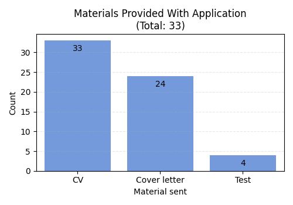

# Job Hunting Project

Following my job hunting process, analyzing the job ads and current status of my job applications. 
 It is rough out there!
 I am applying for positions in 4 main fields:
 &nbsp;&nbsp;&nbsp; - data (looking for junior positions, eager to work with SQL and Python, have completed 72 hours worth of courses and actively learning and practicing),
 &nbsp;&nbsp;&nbsp; - localization (looking for localization PM positions, have 3 years of experience in the localization industry and a degree in Chinese Studies),
 &nbsp;&nbsp;&nbsp; - gaming (mainly applying for localization or PM positions within the gaming industry),
 &nbsp;&nbsp;&nbsp; - PM (2+ years of experience as a project manager).
 
 Notes:
 &nbsp;&nbsp;&nbsp; - data is pulled from 'Applications_GitHub.xlsx'
 &nbsp;&nbsp;&nbsp; - data in the .xlsx which I am sharing on GitHub is incomplete for privacy purposes – company names, direct links for job ads and some other data I'm collecting have been removed
 &nbsp;&nbsp;&nbsp; - libraries used: pandas, matplotlib.pyplot, seaborn
 &nbsp;&nbsp;&nbsp; - colors for plots: https://matplotlib.org/3.3.0/gallery/color/named_colors.html
 
## Outputs

